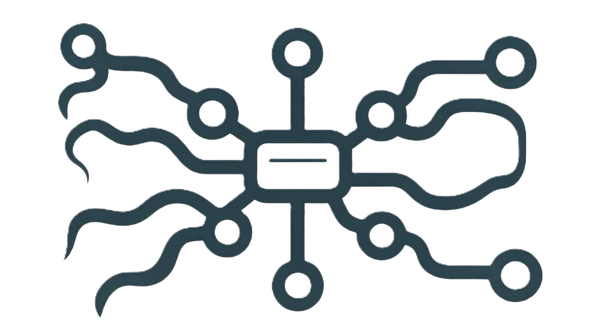

# srt-router

[Features](#features) |
[Advantages](#technical-advantages-and-application-scenarios) |
[Usage](#usage) |
[Installation](#installation) |
[Configuration](#configuration) |
[API Endpoints](#api-endpoints) |
[License](#license) |
[Contact](#contact)


An SRT router for multiplexing SRT caller streams via a single UDP port using standard Stream ID format.

English | [简体中文](./README.zh.md)

## Features

- Transparent Routing: Pass through your stream unchanged from input to output, ensuring the integrity of the original audio/video data and transmission parameters.
- Port Multiplexing: Serve multiple SRT streams through a single UDP port in listener mode, simplifying network configuration and port management.
- Standard Input: Receive SRT caller streams conforming to the standard Stream ID format, supporting key parameters such as m (mode) and r (resource identifier) (e.g., streamid=#!::m=publish,r=srt1).
- Standard Output: Send to target SRT caller streams using the standard Stream ID format, also supporting parameters like m and r (e.g., streamid=#!::m=request,r=srt1).
- Path-based Serving: Serve different streams on separate logical paths based on the r parameter in the Stream ID for management.
- One-to-Many Connections: Support a single peer establishing connections to multiple peers simultaneously for stream distribution.
- Control Interface: Provide an HTTP port serving RESTful APIs for querying server status and managing configuration.
- Hot Reloading: Reload configuration without disconnecting existing streams, enabling seamless service updates.
- Metrics and Logging: Log to stdio and file for troubleshooting and system monitoring in various scenarios.
- Performance: Designed for low latency and high throughput, making it suitable for live streaming applications.

## Technical Advantages and Application Scenarios

The tool is designed to leverage the strengths of the SRT protocol in complex network environments.

Based on UDP, SRT ensures secure, reliable, low-latency transmission with packet loss resistance over public networks through mechanisms like ARQ (Automatic Repeat reQuest) and FEC (Forward Error Correction).

By utilizing port multiplexing and parsing the standard Stream ID, srt-router further simplifies the deployment complexity of large-scale SRT stream aggregation and distribution nodes.

It is suitable for scenarios requiring aggregation of multiple SRT push streams (Caller mode) from the internet into a single entry point, which are then distributed to different backend processing units or distribution networks based on business logic (identified via the r parameter).

Examples include content aggregation for large live-streaming platforms, multi-signal routing, or streaming gateways for edge computing nodes.

## Usage

To run the srt-router, use the following command:

```bash
./srt-router
```

## Installation

To install srt-router, follow these steps:

1. Clone the repository:

   ```bash
   git clone https://github.com/wying71/srt-router.git
   ```

2. Navigate to the project directory:

   ```bash
   cd srt-router
   ```

3. Build the project:

   ```bash
   ./build_srtrouter.sh
   ```

4. Run the application:

   ```bash
   ./srt-router
   ```

## Configuration

The srt-router can be configured using a JSON file. Below is an example configuration:

```json
{
  "srt": {
    "enable": true,
    "listenPort": 8890,
    "encryptions": [
      {
        "path": "*",
        "publishPassphrase": "",
        "requestPassphrase": "",
        "encryptionType": ""
      }
    ]
  },
  "api": {
    "enable": true,
    "listenPort": 3000
  },
  "logging": {
    "logLevel": "info",
    "logFilePath": "logs/srtRouter.log",
    "maxLogSize": 10485760,
    "logKeepDays": 30
  },
  "maxStreamsLimit": 100
}
```

In this configuration:

- `srt.enable`: Enables or disables the SRT routing functionality.
- `srt.listenPort`: The UDP port on which the srt-router will listen for incoming SRT streams.
- `srt.encryptions`: An array of encryption configurations for different paths, specifying the publish and request passphrases and encryption type.
- `api.enable`: Enables or disables the HTTP control interface.
- `api.listenPort`: The port for the HTTP control interface.
- `logging.logFilePath`: The file where logs will be written.
- `logging.logLevel`: The level of logging (e.g., "info", "debug", "error").
- `maxStreamsLimit`: The maximum number of concurrent streams that the router can handle.

## API Endpoints

The srt-router provides the following API endpoints for control and monitoring:

- `GET /api/health`: Check the health status of the srt-router for monitoring and alerting systems.
- `GET /api/status`: Get the current status of the srt-router, including active streams and resource usage.
- `GET /api/streams`: Get a list of active streams and their details.
- `GET /api/streams/{streamId}`: Get detailed information about a specific stream by its ID.
- `GET /api/config`: Retrieve the current configuration of the srt-router for verification and auditing purposes.
- `POST /api/config`: Update the configuration of the srt-router without restarting the service (hot reloading).

TODO: Add more API endpoints for stream management, log retrieval, and performance metrics.

- `GET /api/logs`: Retrieve recent logs for troubleshooting and monitoring.
- `GET /api/metrics`: Get performance metrics and statistics for monitoring and optimization.
- `PUT /api/streams/{streamId}`: Update the configuration of an active stream (e.g., encryption settings) without restarting it, allowing for dynamic adjustments based on network conditions or business requirements..
- `POST /api/config/reload`: Trigger a manual reload of the configuration to apply changes immediately.
- `GET /api/streams/{streamId}/stats`: Retrieve real-time statistics for a specific stream, including bitrate, latency, and packet loss information.
- `GET /api/streams/{streamId}/logs`: Retrieve logs specific to a particular stream for detailed troubleshooting.
- `GET /api/streams/{streamId}/config`: Retrieve the current configuration of a specific stream for monitoring and management purposes.
- `DELETE /api/streams/{streamId}`: Terminate a specific stream by its ID, allowing for manual control over active connections.
- `GET /api/streams/{streamId}/connections`: Retrieve a list of active connections for a specific stream, including peer information and connection status.

## License

srt-router is licensed under the MIT License. See the [LICENSE](LICENSE) file for more details.

## Contact

For questions, issues, or contributions, please open an issue or submit a pull request on the GitHub repository: [https://github.com/wying71/srt-router](https://github.com/wying71/srt-router).
